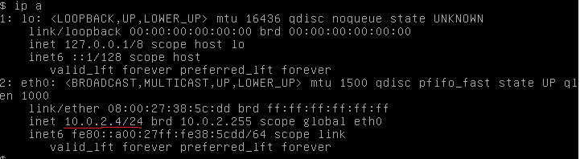

# Note

## Setup

- Cài đặt 1 máy ảo kali và 1 máy protostar:

- Cài đặt mạng 2 máy:

- Lấy địa chỉ ip của máy protostar:

- Lấy folder /opt/protostar/bin về host:

- ssh connect:

## Tools

- gdb.
- Radare2: (also known as r2) is a complete framework for reverse-engineering and analyzing binaries; composed of a set of small utilities that can be used together or independently from the command line. Built around a disassembler for computer software which generates assembly language source code from machine-executable code, it supports a variety of executable formats for different processor architectures and operating systems.

### Radare2

static:

- aaa: analysis
- afl: list function
- axt: xref to
- axf: xref from
- is: list symbols
- iE: list exports
- ii: list imports
- iS: list sections
- iz: list strings (in data sections, iz? for more details)
- ia: = ii + iE + iS + ...
- V!: enter visual panel mode
- ...
debug mode:
- db: breakpoints commands
- dc: continue execution
- afvd: displaying the value of args/locals in the debugger
- ...

## References

- VirtualBox Networking: <https://www.youtube.com/watch?v=cDF4X7RmV4Q>
- Radare2 tutorial: <https://youtube.com/playlist?list=PLg_QXA4bGHpvsW-qeoi3_yhiZg8zBzNwQ>
- The official Radare2 Book: <https://book.rada.re/>
