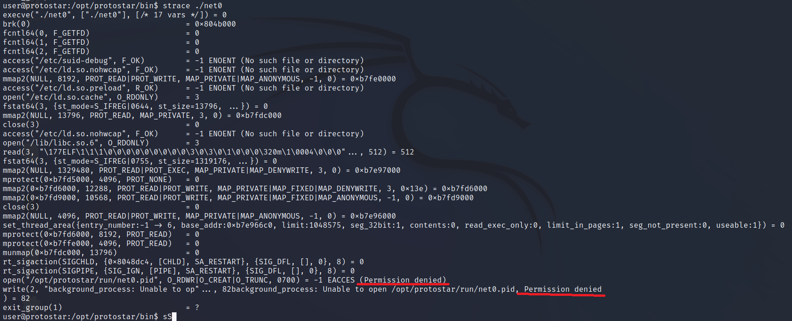
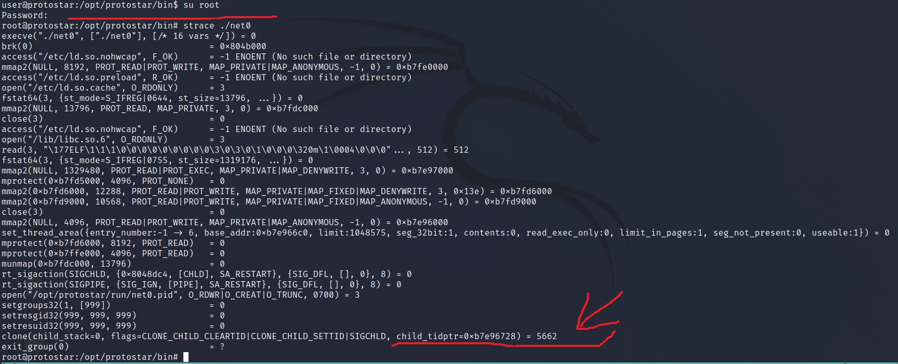
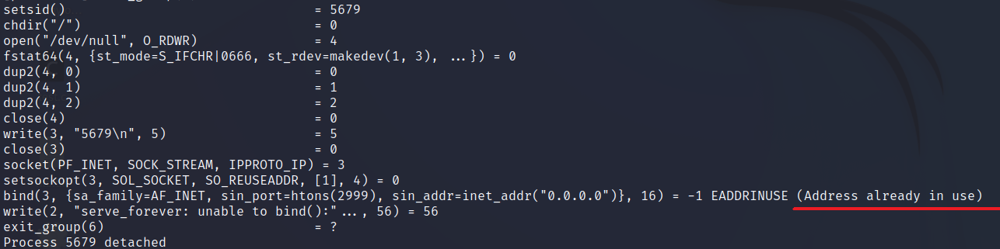
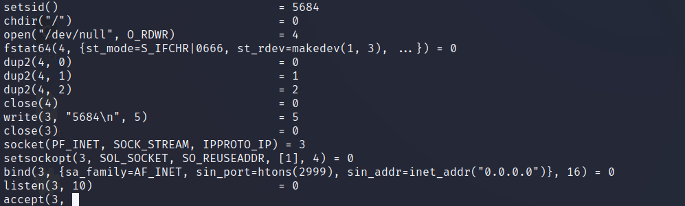
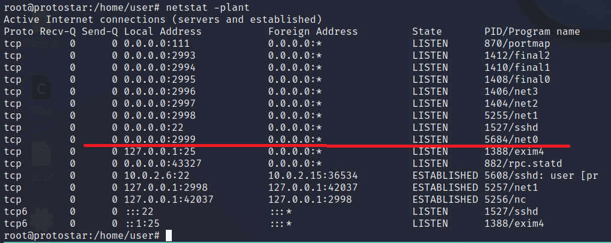
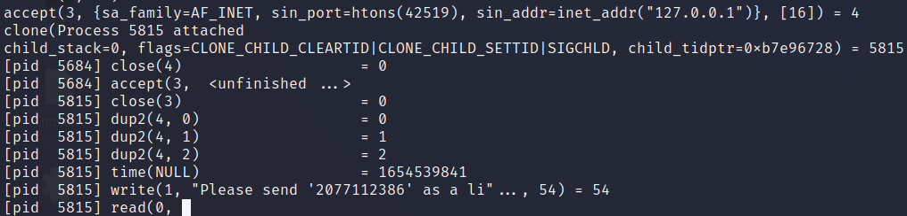

# **net0**
## Source code
```
#include "../common/common.c"

#define NAME "net0"
#define UID 999
#define GID 999
#define PORT 2999

void run()
{
  unsigned int i;
  unsigned int wanted;

  wanted = random();

  printf("Please send '%d' as a little endian 32bit int\n", wanted);

  if(fread(&i, sizeof(i), 1, stdin) == NULL) {
      errx(1, ":(\n");
  }

  if(i == wanted) {
      printf("Thank you sir/madam\n");
  } else {
      printf("I'm sorry, you sent %d instead\n", i);
  }
}

int main(int argc, char **argv, char **envp)
{
  int fd;
  char *username;

  /* Run the process as a daemon */
  background_process(NAME, UID, GID); 
  
  /* Wait for socket activity and return */
  fd = serve_forever(PORT);

  /* Set the client socket to STDIN, STDOUT, and STDERR */
  set_io(fd);

  /* Don't do this :> */
  srandom(time(NULL));

  run();
}
```

## Một số từ khoá trong đề bài
- **daemon**: In multitasking computer operating systems, a daemon is a computer program that runs as a background process, rather than being under the direct control of an interactive user. (Theo wikipedia: [link](https://en.wikipedia.org/wiki/Daemon_(computing)))
- **stdin, stdout, stderr**: stdin, stdout, and stderr are three data streams created when you launch a Linux command. The file descriptor of stdin, stdout, stderr are always:
    - stdin: 0
    - stdout: 1
    - stderr: 2

## Tools
- strace: used to trace the system calls made by the program
- python
- netstat
- netcat

## Phân tích 
Chạy thử chương trình, ta thấy không có gì xảy ra, tuy nhiên có từ khóa gợi ý **daemon** nên ta dùng ```ps aux | grep 'net0'``` để kiểm tra => có background process.
```
user@protostar:/opt/protostar/bin$ ./net0
user@protostar:/opt/protostar/bin$ ps aux | grep net0
999       5102  0.0  0.1   1532   280 ?        Ss   09:59   0:00 ./net0
user      5642  0.0  0.2   3296   728 pts/5    S+   13:44   0:00 grep net0
user@protostar:/opt/protostar/bin$ 
```
Ta thấy chương trình có #include một user defined library, trong chương trình cũng có một số hàm nonstandard => sử dụng strace để quan sát chương trình.



Tuy nhiên ta gặp lỗi permission, theo như tìm hiểu thì: "Linux ignores the setuid bit when running a process under strace or similar programs" ([link](https://superuser.com/a/248127)). => chạy strace bằng root để có đủ permission.
- Đăng nhập bằng tài khoản root với credential: root/godmode



Quan sát thấy chương trình có gọi clone() sau đó exit, sử dụng strace với -f để quan sát cả tiến trình con:
```
#strace -f /opt/protostar/bin/net0
```


Xuất hiện lỗi ```Address already in use``` ở hàm bind(), do địa chỉ và port đã được sử dụng bởi net0 background process trước đó => kill và chạy lại.
```
root@protostar:/opt/protostar/bin# ps aux | grep net0
999       5102  0.0  0.1   1532   280 ?        Ss   09:59   0:00 ./net0
root      5681  0.0  0.2   3296   728 pts/5    S+   13:56   0:00 grep net0
root@protostar:/opt/protostar/bin# kill 9 5102
root@protostar:/opt/protostar/bin# strace -f ./net0
```


Ok, sử dụng ```netstat -pl```:
  - -p: Show the PID and name of the program to which each socket belongs.
  - -l: Show only listening sockets.  (These are omitted by default.)



Mở một cửa sổ terminal khác, sử dụng netcat tới địa chỉ của chương trình: 127.0.0.1 2999
```
nc 127.0.0.1 2999
```
Quay lại strace:



Trong đó:
- accept() return 4: file descriptor của accepted socket. 
- dup2(4, 0), dup2(4, 1), dup2(4, 2): bất kì hàm nào gọi đền file descriptor 0, 1, 2 (stdin, stdout, stderr) sẽ thay bằng 4 (socket).
- write(1, ...) = write(4, ...): = gửi đến client. 

## Final
Ta cần gửi qua netcat một số ngẫu nhiên dưới dạng little endian:
```
root@protostar:/home/user# nc 127.0.0.1 2999
Please send '2077112386' as a little endian 32bit int
```
Sử dụng python để connect tới địa chỉ thay vì netcat:
```
#!/usr/bin/env python

import socket
import struct

if __name__ == "__main__":
        s = socket.socket()
        s.connect(("127.0.0.1", 2999))

        data = s.recv(1024)

        #Lấy số ngẫu nhiên server sinh ra
        number = int((data.split()[2])[1:-1])

        #sử dụng struct.pack() để đổi về little endian
        s.send(str(struct.pack("I", number)))

        # nhận và in kết quả
        data = s.recv(1024)
        print(data)
```
Result:
```
user@protostar:/tmp$ python script.py 
Thank you sir/madam
```
# References
- daemon: [link](https://en.wikipedia.org/wiki/Daemon_(computing))
- stdin stdout stderr: [link](https://www.howtogeek.com/435903/what-are-stdin-stdout-and-stderr-on-linux/)
- strace permissions problem: [link](https://superuser.com/a/248127)