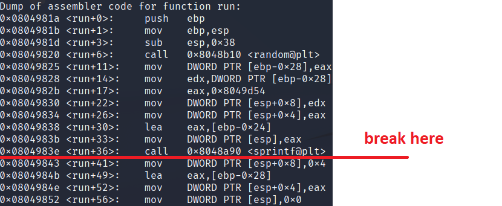
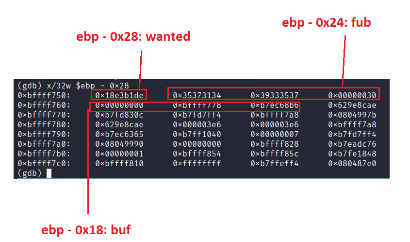
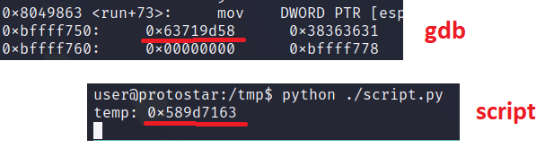

# **net1**
## Source code
```
#include "../common/common.c"

#define NAME "net1"
#define UID 998
#define GID 998
#define PORT 2998

void run()
{
  char buf[12];
  char fub[12];
  char *q;

  unsigned int wanted;

  wanted = random();

  sprintf(fub, "%d", wanted);

  if(write(0, &wanted, sizeof(wanted)) != sizeof(wanted)) {
      errx(1, ":(\n");
  }

  if(fgets(buf, sizeof(buf)-1, stdin) == NULL) {
      errx(1, ":(\n");
  }

  q = strchr(buf, '\r'); if(q) *q = 0;
  q = strchr(buf, '\n'); if(q) *q = 0;

  if(strcmp(fub, buf) == 0) {
      printf("you correctly sent the data\n");
  } else {
      printf("you didn't send the data properly\n");
  }
}

int main(int argc, char **argv, char **envp)
{
  int fd;
  char *username;

  /* Run the process as a daemon */
  background_process(NAME, UID, GID); 
  
  /* Wait for socket activity and return */
  fd = serve_forever(PORT);

  /* Set the client socket to STDIN, STDOUT, and STDERR */
  set_io(fd);

  /* Don't do this :> */
  srandom(time(NULL));

  run();
}
```

## Tools
- gdb
- python
- netcat

## Phân tích source code
run(): 
  - ngẫu nhiên một số wanted
  - format string %d với số wanted ghi vào fub
  - gửi cho client số wanted
  - đọc input từ client lưu vào buf bằng fgets()
  - strcmp() fub và buf

mục tiêu:
  - buf == fub

## Phân tích 
Tương tự như net0, net1 chạy tiến trình con, lắng nghe ở cổng 2998, dup2 socket file descriptor tới stdin, stdout, stderr.

Sử dụng strace, quan sát được server gửi về cho client một string:
```
[pid  6175] write(0, "\22*Yy", 4)       = 4
```

"\22*Yy" là gì? Sử dụng gdb để phân tích net1(kill net1 trước khi debug):
  - ```set follow-fork-mode child``` để gdb follow tiến trình con:
  - đặt break point ở dưới lệnh gọi sprintf()

    
  - chạy đến breakpoint và dùng ```x/32w $ebp-0x28``` để quan sát stack, cộng với phân tích code =>:

    
      - ebp - 0x28: số ngẫu nhiên wanted
      - ebp - 0x24: dạng string của số ngẫu nhiên wanted cơ số 10
      - ebp - 0x18: input của client
=> Client nhận được 4 bytes ở ebp-0x28 nhưng ở dưới dạng string, Cần:
  - Ghép 4 bytes nhận được từ server lại rồi lấy giá trị số cơ số 10.
  - Gửi string biểu diễn số ở trên cho server.

## Final
Viết python script:
```
#!/usr/bin/env python

import socket
import struct

if __name__ == "__main__":
        s = socket.socket()
        s.connect(("127.0.0.1", 2998))
        data = s.recv(1024)

        # Ghép 4 bytes nhận được lại với tiền tố 0x
        temp = "0x"
        for c in data:
                temp += c.encode('hex')
        print "temp:", temp

        # Chuyển về cơ số 10, sau đó chuyển sang str rồi gửi cho server
        result = str(int(temp, 0))
        s.send(result)

        data = s.recv(1024)
        print(data)

        s.close()
```
Kết quả: thất bại

Lý do: int được đọc theo kiểu little endian nhưng string thì lại được đọc lần lượt, do đó bị ngược.


 
Sửa lại python script:
```
#!/usr/bin/env python

import socket
import struct

if __name__ == "__main__":
        s = socket.socket()
        s.connect(("127.0.0.1", 2998))
        data = s.recv(1024)

        # Ghép 4 bytes nhận được lại với tiền tố 0x
        temp = "0x"
        for c in reversed(data):                        #<--------------------- thêm reversed()
                temp += c.encode('hex')
        print "temp:", temp

        # Chuyển về cơ số 10, sau đó chuyển sang str rồi gửi cho server
        result = str(int(temp, 0))
        s.send(result)

        data = s.recv(1024)
        print(data)

        s.close()
```
Kết quả:
```
user@protostar:/tmp$ python ./script.py 
temp: 0x6db95976
you correctly sent the data
```

# References