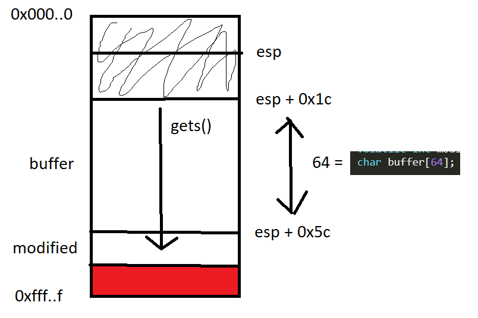

# **stack0**
## Source code
```
#include <stdlib.h>
#include <unistd.h>
#include <stdio.h>

int main(int argc, char **argv)
{
  volatile int modified;
  char buffer[64];

  modified = 0;
  gets(buffer);

  if(modified != 0) {
      printf("you have changed the 'modified' variable\n");
  } else {
      printf("Try again?\n");
  }
}
```

New knowledge:
- volatile: The volatile keyword is intended to prevent the compiler from applying any optimizations on objects that can change in ways that cannot be determined by the compiler. 
Objects declared as volatile are omitted from optimization because their values can be changed by code outside the scope of current code at any time. The system always reads the current value of a volatile object from the memory location rather than keeping its value in temporary register at the point it is requested, even if a previous instruction asked for a value from the same object. 

## Target
printf("you have changed the 'modified' variable\n");

## Vulnerability
gets(): chỉ nhận vào một con trỏ, không biết độ lớn của vùng nhớ đó là bao nhiêu => có thể ghi đè ra ngoài.

## Recon

```
┌──(kali㉿kali)-[~/Documents/week9/bin]
└─$ rabin2 -I ./stack0
arch     x86
baddr    0x8048000
binsz    22412
bintype  elf
bits     32
canary   false
class    ELF32
compiler GCC: (Debian 4.4.5-8) 4.4.5 GCC: (Debian 4.4.5-10) 4.4.5
crypto   false
endian   little
havecode true
intrp    /lib/ld-linux.so.2
laddr    0x0
lang     c
linenum  true
lsyms    true
machine  Intel 80386
nx       false
os       linux
pic      false
relocs   true
relro    no
rpath    NONE
sanitize false
static   false
stripped false
subsys   linux
va       true
```

## Exploit
- Open r2, analyze:
```
┌──(kali㉿kali)-[~/Documents/week9/bin]
└─$ r2 ./stack0       
[0x08048340]> aaa
[x] Analyze all flags starting with sym. and entry0 (aa)
[x] Analyze function calls (aac)
[x] Analyze len bytes of instructions for references (aar)
[x] Finding and parsing C++ vtables (avrr)
[x] Type matching analysis for all functions (aaft)
[x] Propagate noreturn information (aanr)
[x] Use -AA or aaaa to perform additional experimental analysis.
```
- Seek to main, open visual mode:
```
[0x08048340]> s main
[0x080483f4]> V
```
- Visual mode:


- Press p/P to rotate print modes (hex, diasm, debug, words, buf), rotate to diasm mode:


- Thấy 1 call đến gets, 2 call đến puts => nhanh chóng đối chiếu được source code với disas:


- Phân tích stack:



=> Chỉ cần nhập quá 64 ký tự là sẽ ghi đè lên giá trị của biến modified:


# References
- volatile keyword: https://www.geeksforgeeks.org/understanding-volatile-qualifier-in-c/
- gets() function vulnerabilities: https://faq.cprogramming.com/cgi-bin/smartfaq.cgi?answer=1049157810&id=1043284351